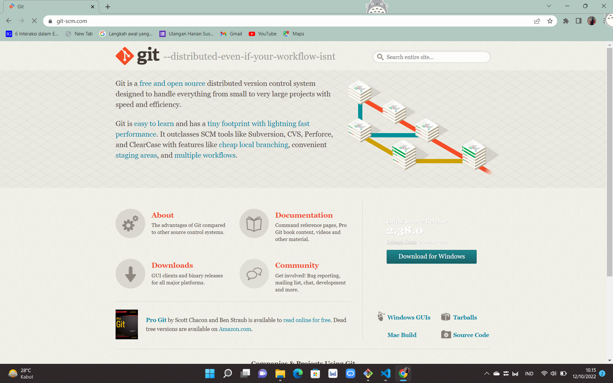
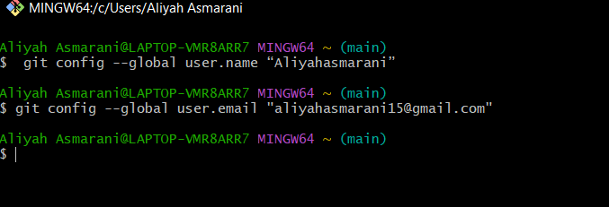
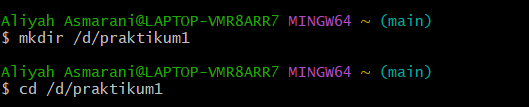
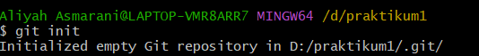
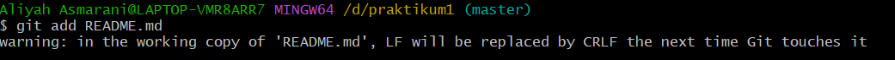

## Latihan1 

## TUGAS BAHASA PEMROGRAMAN

## INSTALASI GIT
Membuka website resmi GIT yaitu (git-scm.com), lalu mendownload sesuai OS 


## MEMBUKA GIT BASH
Setelah mendownload lalu membuka GIT BASH


## MENAMBAHKAN GLOBAL CONFIG
Pada saat pertama kali menggunakan git, perlu dilakukan konfigurasi user.name dan user.email
Konfigurasi ini bisa dilakukan untuk globab repositiry atau indovidual repository.
Apabila belum dilakukan konfigurasi, akan mengakibatkan terjadi kegagalan saat menjalankan perintah git commit
Config Global Repository


## MEMBUAT REPOSITORY LOCAL
Buka direktory aktif, misal: /d/praktikum1
```
mkdir praktikum1
cd praktikum1
```


## MENJALANKAN GIT INIT
Dengan perintah
```
git init
```


## MENAMBAHKAN FILE BARU PADA REPOSITORY
Untuk membuat file dapat menggunakan text editor, lalu menyimpan filenya pada direktori aktif (repository)
```
echo "#Latihan1" >> README.md
```


Untuk menambahkan file yang baru saja dibuat tersebut gunakan perintah git add.
```
git add README.md
```



