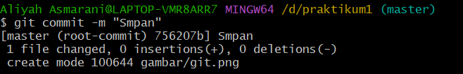

## Latihan1 

## TUGAS BAHASA PEMROGRAMAN

## INSTALASI GIT
Membuka website resmi GIT yaitu (git-scm.com), lalu mendownload sesuai OS 


## MEMBUKA GIT BASH
Setelah mendownload lalu membuka GIT BASH


## MENAMBAHKAN GLOBAL CONFIG
Pada saat pertama kali menggunakan git, perlu dilakukan konfigurasi user.name dan user.email
Konfigurasi ini bisa dilakukan untuk globab repositiry atau indovidual repository.
Apabila belum dilakukan konfigurasi, akan mengakibatkan terjadi kegagalan saat menjalankan perintah git commit
Config Global Repository


## MEMBUAT REPOSITORY LOCAL
Buka direktory aktif, misal: /d/praktikum1
```
mkdir praktikum1
cd praktikum1
```


## MENJALANKAN GIT INIT
Dengan perintah
```
git init
```


## MENAMBAHKAN FILE BARU PADA REPOSITORY
Untuk membuat file dapat menggunakan text editor, lalu menyimpan filenya pada direktori aktif (repository)
```
echo "#Latihan1" >> README.md
```


Untuk menambahkan file yang baru saja dibuat tersebut gunakan perintah git add.
```
git add README.md
```


## MENYIMPAN PERUBAHAN KE DATABASE (COMMIT)
Untuk menyimpan perubahan yang ada kedalam database repository local, gunakan perintah
```
git commit -m "simpan1"
```


## MEMBUAT REPOSITORY SERVER
Server repository yang akan digunakan adalah
```
https://github.com
```
Kalian harus membuat akun terlebih dahulu.
Pada laman github, klik tombol start a project, atau dari menu (icon +) klik New Repository


## MEMBUAT REPOSITORY SERVER
Isi nama repositorynya, misal:Rani1.
Lalu klik tombol Create repository


## MENAMBAHKAN REMOTE REPOSITORY
Remote Repository merupakan repository server yang akan digunakan untuk menyimpan setiap perubahan pada local repository, sehingga dapat diakses oleh banyak user.
untuk menambahkan remote repository server, gunakan perintah
```
git remote add origin [url]
git remote add origin https://github.com/Aliyahasmarani/Praktikum1.git
```


## MENGIRIM PERUBAHAN KE SERVER (PUSH)
Untuk mengirim perubahan pada local repository ke server gunakan perintah git push.
```
git push -u origin master
```

perintah ini akan meminta memasukkan username dan password pada akun github.com

